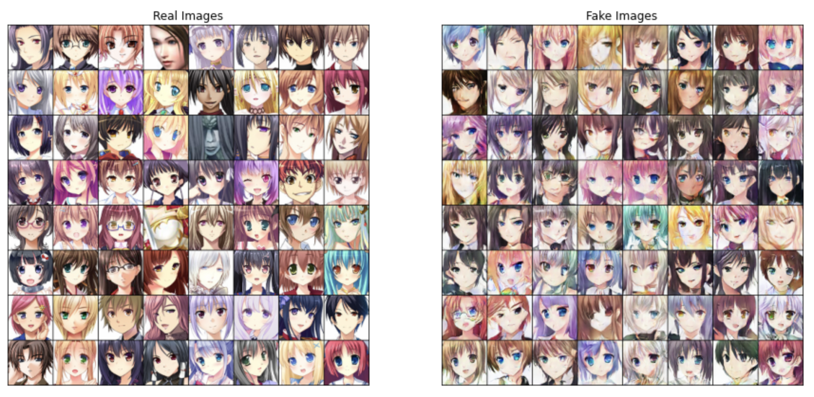

# Artificial-Anime-Character-Design
### An Application of Generative Adversarial Networks (GANs)  

This repository contains implementations of Generative Adversarial Networks (GANs) to design and generate new face images of anime characters. A few improvement techniques were implemented to enhance the performance of the Deep Covolutional GANs (DCGANs) as well as the quality of the output. Also included is an implementation of Least Squares GAN (LSGAN) and NVIDIA's open source [StyleGAN](https://github.com/lucidrains/stylegan2-pytorch). StyleGAN and StyleGAN2 are new state-of-the-art GAN architectures developed by a team from NVIDIA (Karras et al., 2018; 2019). These architectures address many of the shortcomings of previous GAN implementations and dramatically increase image quality.  

This was also used as a final project for the CIS 519. For more details, please read our report.  

## Dataset

Our dataset consists of 21551 unlabeled anime faces obtained from [Kaggle](https://www.kaggle.com/soumikrakshit/anime-faces) (Rakshit, 2019). This is a cleaner version of a dataset originally on Github (Chao, 2019) where the images are fetched from Getchu.com and then cropped using the anime face detection algorithm (Nagadomi, 2011).

## Methods

Our base model architecture is inspired by Deep Convolutional GAN (DCGAN) (Radford et al., 2015). The discriminator is made up of strided convolution layers, 2d batch norm layers, LeakyReLUs, and outputs the final probability through a Sigmoid activation function. The generator consists of a series of strided two dimensional convolutional transpose layers, each followed by a 2d batch norm layer and a ReLU activation. The outputs go through a tanh function.

We used a batch size of 64 and a feature length of 100 for vector z. For both the G and D, we use Adam optimizer because it combines the best properties of the AdaGrad and RMSProp algorithms, which can handle sparse gradients
on noisy problems. Since D learns much faster than G, we set the learning rate for optimizer for G at 0.0005 and optimizer for D at 0.0001. Additionally, we used fuzzy labels - instead of a hard 0 or 1 as labels for the discriminator, we set them to 0.1 and 0.9 to make the discriminator weaker.

## Training

Generator (left) and Discriminator (right) losses

  

  

Progress of generator

  

  

## Results

## LSGAN 

See more information and details in notebook and report.

## StyleGAN

Results

  

  

See more information and details in notebook and report.

## Conclusion

In this work, we explored the artificial creation of the anime characters using GANs. By extracting a clean data set and
introducing several practical training strategies, we showed that DCGANs can produce convincing fakes. We then implemented StyleGAN, a major improvement on DCGAN both qualitatively and by FID score.

## Acknowledgement 

We acknowledge NVIDIA for their open-source StyleGAN implementation (Karras et al., 2019), Google for the Inception V3 model (Google, 2015), and mseitzer for the FID calculation code(Mseitzer, 2020).

## References

See report for details.
